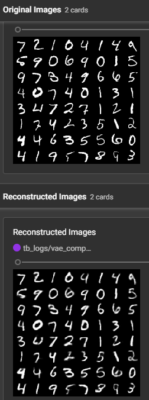

# Variational Autoencoder trained on MNIST images

This repository contains my code for training a VAE with linear layers on MNIST images using PyTorch Lightning. The model checkpoint can be found in the checkpoints folder

